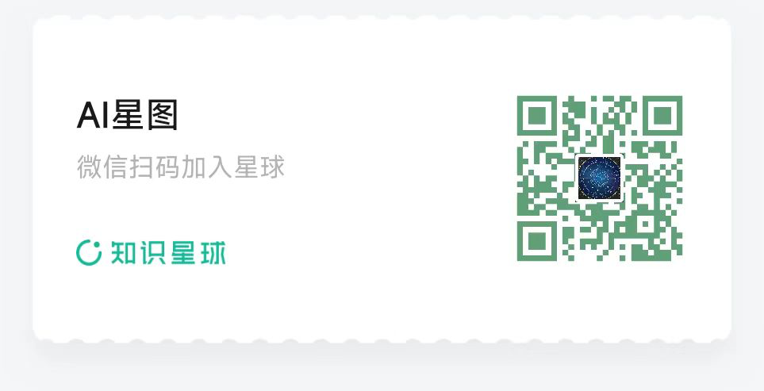

# AI星图

人工智能（AI）正迅速改变着我们生活的方方面面。特别是在大模型的领域，AI技术正在突破传统的边界，推动着自动化、智能决策和个性化服务的发展。从自然语言处理到图像识别，大模型通过深度学习和大规模数据分析，为各个行业提供了前所未有的洞察力和效率。

未来，AI大模型将进一步提升智能系统的能力，使其能够处理更加复杂的任务，理解更加深刻的语境，并且与人类进行更自然的互动。这一进步不仅将推动科技创新，还将带来新的商业机会和社会变革。

## 👋 [加入我们的群](./wechat.jpg)

我们诚邀您加入我们的AI星图，一起探索未来科技的无限可能。无论您是AI领域的新手还是有经验的专家，我们的课程都将为您提供深入的知识、实践的机会和行业的前沿动态。通过我们的课程，您将获得宝贵的技能，了解最新的技术趋势，并与志同道合的专业人士建立联系。

赶快行动吧，成为AI革命的一部分，与我们一起开启智能时代的新时代！

##  [加入知识星球](./zsxq.png)

此外，加入我们的知识星球，您将能够更早获得最新的课程内容，并与我们进行更加深入的交流。通过加入，您不仅可以提前接触到最新的课程，还有机会参与更多高水平的讨论和学习。不要错过这个提升自己、拓宽视野的绝佳机会！

---

# AI Star Chart

Artificial Intelligence (AI) is rapidly transforming every aspect of our lives. In particular, the field of large models is pushing the boundaries of traditional AI, driving advancements in automation, intelligent decision-making, and personalized services. From natural language processing to image recognition, large models offer unprecedented insights and efficiency through deep learning and large-scale data analysis.

In the future, AI large models will further enhance the capabilities of intelligent systems, enabling them to handle more complex tasks, understand deeper contexts, and interact with humans more naturally. This progress will not only drive technological innovation but also bring new business opportunities and societal changes.

## 👋 [Join Our Group](./wechat.jpg)

We invite you to join our AI Star Chart and explore the limitless possibilities of future technology. Whether you are a newcomer or an experienced professional in the AI field, our course will provide you with in-depth knowledge, practical opportunities, and the latest industry trends. Through our course, you will gain valuable skills, stay updated with cutting-edge technology, and connect with like-minded professionals.

Act now to be part of the AI revolution and start a new era of intelligence with us!

##  [Join Knowledge Planet](./zsxq.png)

Additionally, by joining our Knowledge Planet, you will gain early access to the latest course content and engage in deeper discussions with us. Not only will you get a preview of upcoming materials, but you will also have opportunities to participate in high-level discussions and learning experiences. Don’t miss this excellent opportunity to enhance yourself and broaden your horizons!

